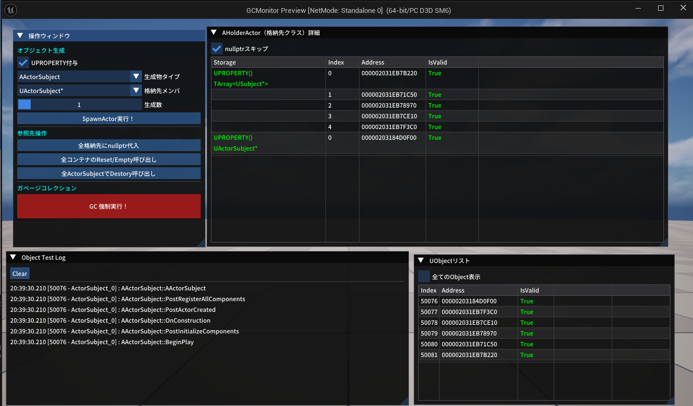
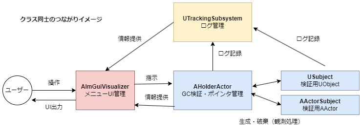

# GCMonitor

UObect生成・破棄により起きる出来事を観測するためのプログラムです。 
主にガベージコレクションの挙動を追うために作りました。 
現在はUObject、AActorをサポートしています。 

## 動作環境
- Unreal Engine 5.6.1
- VisualStudio 2022

### 外部ライブラリ

- [Unreal ImGuiプラグイン (benui-dev/UnrealImGui)：MIT License](https://github.com/benui-dev/UnrealImGui)  
  Unreal Engine 5 向けに Dear ImGui を統合するプラグイン。ImPlotなどの拡張にも対応。

- [Dear ImGui (Omar Cornut)：MIT License](https://github.com/ocornut/imgui)  
  軽量で移植性の高いGUIライブラリ。Unreal ImGuiはこのライブラリをUnreal Engineに対応させたもの。

## 構成

### 主要クラス

- [AImGuiVisualizer](https://github.com/7jibi8rm/GCMonitor/blob/master/Source/GCMonitor/Public/ImGuiVisualizer.h) 
ImGuiを用いたメニューの実装です。 
画面上に表示されているUIは全てこのクラスが管理しています。 

- [AHolderActor](https://github.com/7jibi8rm/GCMonitor/blob/master/Source/GCMonitor/Public/HolderActor.h) 
観測対象となるUObject・AActorを管理するアクターです。 
AImGuiVisualizerからの要求に答えて実際の検証操作を実行します。 

- [AActorSubject](https://github.com/7jibi8rm/GCMonitor/blob/master/Source/GCMonitor/Public/ActorSubject.h) 
観測対象のAActorクラス 
ログ等の観測用処理が必要なため、AActorはそのまま使わず独自継承したクラスを使用。 

- [USubject](https://github.com/7jibi8rm/GCMonitor/blob/master/Source/GCMonitor/Public/Subject.h) 
観測対象のUObjectクラス 
AActorSubjectと同様に、観測用の処理のため独自継承しています。 

- [UTrackingSubsystem](https://github.com/7jibi8rm/GCMonitor/blob/master/Source/GCMonitor/Public/TrackingSubsystem.h) 
ログを管理しています。 
観測データを参照しやすいよう、ログ用文字列を独自クラスで管理しています。 